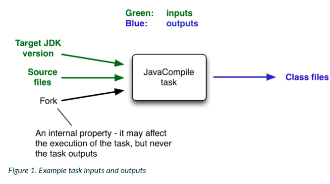

## Up-to-date-checks (AKA Incremental build)
* __An important part of any build tool is the ability to avoid doing work that has already been done__.
* We consider the process of compilation.
* __Once our source files have been compiled, there should be no need to recompile them unless something has changed that affects the output, such as the modification of a source file or the removal of an output file.__
*  Compilation can take a significant amount of time, so skipping the step when it's not needed saves a lot of time.
* __Incremental build:__ Gradle supports this behavior out of the box through a feature it calls __incremental build__.
* We have almost certainly already seen it in action.
* __It's active nearly every time the `UP-To-DATE` text appears next to the name of task when we run a build.__

## How does incremental build work?

### Task inputs and outputs
* In the most common case, a task takes some inputs and generates some outputs.
* If we use the compilation example from earlier, we can see that the source files are the input and, in the case of Java, the generated class files are the outputs.
* Other inputs might include things like whether debug information should be included.

* An important characteristics of an input is that it affects one or more outputs, as we can see from the previous figure.
* __Different bytecode is generated depending on the content of the source files and the maximum version of the Java runtime we want to run the code on.__
* __But whether compilation has 500MB or 600MB of maximum memory available, determined by the `memoryMaximumSize` property, has no impact on what bytecode gets generated.__
* In Gradle terminology, `memoryMaximumSize` is just an internal task property.
