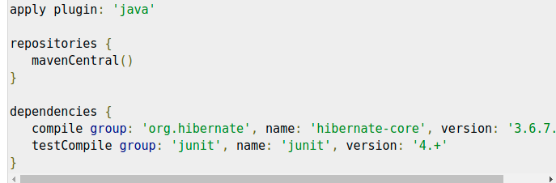
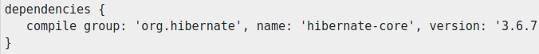
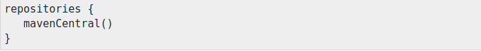
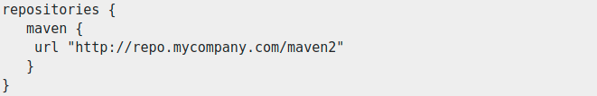
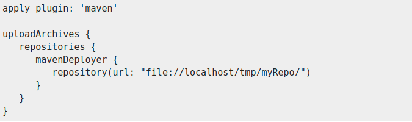

### Introduction
* Gradle build script defines a process to build projects.
* Each project contains some dependencies and some __publications__.
* __Dependencies__ refer to the things that supports in building our project, such as required JAR file from other projects and external JARs like JDBC JAR or Eh-cache JAR in the class path.
* __Publications means the outcomes of the project, such as test class file, build files and war files.__
* All the projects are not self-contained. They need files which are built by the other projects to compile and test the source files.
* __For example:__ In order to use __Hibernate__ in the project, we need to include some __Hibernate JARs__ in the classpath.
* Gradle uses some special script to define the dependencies, which needs to be downloaded.
* __Publishing:__
    * Gradle handles building and publishing the outcomes.
    * Publishing is based on the task that we define.
    * It might want to copy files to local directory, or upload them to a remote Mave or Ivy repository or we might use the files from another project in the same multi-project build.
    * __We can call the process of publishing a task as publication.__
    
### Declaring our dependencies
* __Dependency configuration defines a set of dependencies.__
* We can use this feature to declare external dependencies, which we want to download from the web.
  

### Dependency Configurations
* Dependency configuration defines __a set of dependencies__.
* We can use this feature to declare external dependencies, which we want to download from the web.
* This defines the following different standard configurations:
  * __Compile:__ The dependencies required to compile the production source of the project.
  * __Runtime:__ The dependencies required by the production classes at runtime. By default, it also includes the compile time dependencies.
  * __Test Compile:__ The dependencies required to compile the test source of the project. __By default, it includes compiled production classes and the compile time dependencies__.
  * __Test Runtime:__ The dependencies required to run the tests. __By default, it includes runtime and test compile dependencies.__
  
### External Dependencies
* External dependencies are one of the type of dependencies.
* This is a dependency on some files built on the current build, and stored in a repository of some kind, such as Maven central, or a corporate Maven or Ivy repository, or a directory which is the local file system.

* An external dependency is declaring the external dependencies and the shortcut form looks like: __group:name:version__

### Repositories
* While adding external dependencies, Gradle looks for them in a repository.
* __A collection fo files, organized by group, name and version is termed as a repository.__
* __By default, Gradle does not define any repositories.__
* We have to define __at least one repository explicitly.__
* The following code snippet defines how to define maven repository.

* Following code is to define remote maven.

### Publishing Artifacts
* Dependency configurations are also used to publish files.
* These published files are called __artifacts__.
* Usually, we use plug-ins to define __artifacts__.
* However, we do need to tell Gradle, where to publish the artifacts.
* __We can achieve this by attaching repositories to the upload archives task.__
* Let's take a look at the following syntax for publishing Maven repository.

* While executing, Gradle will generate and upload a __Pom.xml__ as per the project requirements.  