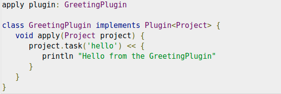
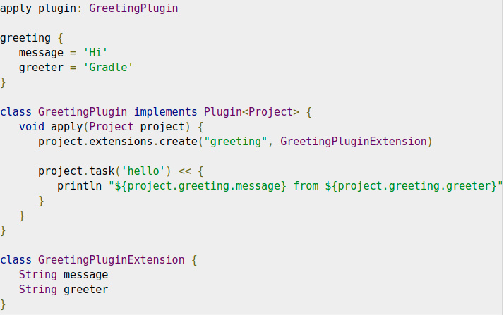

## Gradle - Plugins

* __Plugin:__ Plugin is nothing but __set of all useful tasks__, such as:
    * compiling tasks.
    * setting domain objects.
    * setting up source files etc.
* __Applying a plugin to a project means that it allows the plugin to extend the project's capabilities.__

### What Plugins can do?

* __Extends Basic Gradle Model:__ Extend the basic Gradle model (e.g. add new DSL elements that can be configured).
* __Configure the project:__ Configure the project, according to conversions (e.g. add new tasks or configure sensible
  defaults).
* __Apply specific configuration:__ Add organisational repositories or enforce standards.

### Types of Plugins

* There are two types of plugins in Gradle, which are as follows:
    * __Script plugins:__
        * __Declarative approach:__ Script plugins is an additional build script that gives a declarative approach to
          manipulating the build.
        * __This is typically used within a build.__
    * __Binary plugins:__
        * __Programmatic approach:__ Binary plugins are the classes, that implements the plugin interface and adopt a
          programmatic approach to manipulating the build.
        * __Reside with a build script:__ Binary plugins can reside with a build script, with the project hierarchy or
          externally in a plugin JAR.

### Applying Plugins

* __Project.apply()__ API method is used to apply the particular plugin.
* We can use the same plugin for mulitple times.

### Script Plugins

* Script plugins can be applied from a script __on the local filesystem or at a remote location__.
* __Filesystem locations are relative to the project directory, while remote script locations specify HTTP URL.__
* Let's look at this snippet. It is used at __other.gradle__ plugin to the build script.
  

### Binary Plugins

* __Each plugin is identified by plugin id.__
* __Some core plugins use short names to apply the plugin id and some community plugins use fully qualified name for
  plugin id__.
* Sometimes, it allows to specify the class of plugin.
* The following figure shows how to apply java plugin by using its type.
  
* The following figure shows how to apply core plugin using short name.
  
* The following figure shows how to apply community plugin using short name.
  

### Writing Custom Plugins

* While creating a custom plugin, we need to write an implementation of plugin.
* Gradle instantiates the plugin and calls the plugin instance using __Plugin.apply()__ method.
* The following example contains a greeting plugin, which adds a hello task to the project.
  

### Getting Input from Build

* Most of the plugins need the configuration support from the build script.
* __The Gradle project has an associated ExtensionContainer object that helps to track all the setting and properties
  being passed to plugins.__
* __Example-1:__ Let's add a simple extension object to the project.
  
* __Code explanation:__
    * In this example, __GreetingPlugin__ is a simple, old Groovy object with a field called message.
    * The extension object is added to the plugin list with the name greeting.
    * This object, then becomes available as a project property with the same name as the extension object.
* __Example-2:__ Gradle adds a configuration closure for each extension object, so we can group the settings together.
  Let's take a look:
  

### Standard Gradle Plugins

* There are different plugins which are included in the Gradle distribution.

### Language Plugins

These plugins add support for various languages which can be compiled and executed in the JVM.

| Plugin Id  | Automatically Applies | Description |
| ------------- | ------------- | ------------- |
| java  |    java-base  |    Adds Java compilation, testing, and bundling capabilities to a project. It serves as the basis for many of other Gradle plugins |
| groovy  |    java,groovy-base  |    Adds support for building Groovy projects. |
| scala  |    java,scala-base  |    Adds support for building Scala projects. |

### Incubating Language support

| Plugin Id  | Automatically Applies | Description |
| ------------- | ------------- | ------------- |
| assembler  | 	  |    Adds native assembly language capabilities to a project. |
| c  | 	  |    Adds C source compilation capabilities to a project. |
| cpp  | 	 |    Adds C++ source compilation capabilities to a project. |
| objective-c  | 	  |    Adds Objective-C source compilation capabilities to a project. |
| objective-cpp  | 	  |        Adds Objective-C++ source compilation capabilities to a project. |
| windows-resources  | 	  |    Adds support for including Windows resources in native binaries. |
